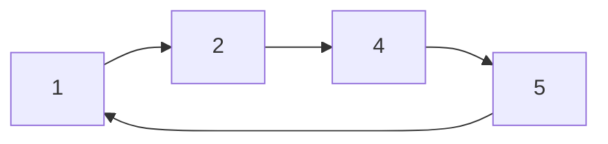
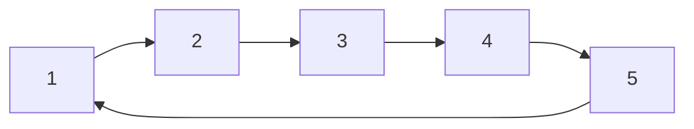

### 1.链表逆序

给定一个单向链表 1->2->3->NULL，逆序后变成 3->2->1->NULL  [来源](https://mp.weixin.qq.com/s?__biz=MzIyNDU2ODA4OQ==&mid=2247484119&idx=1&sn=afe15006f7452150c9a79f868a3147e4&chksm=e80db4a1df7a3db779dc3f28e2352f449833b1ae51cdbc048ebcc070679d617b01c0b42ceebe&scene=21#wechat_redirect) 

```java
private ListNode reverseList(ListNode head) {

    if (head == null || head.next == null) return head;

    ListNode reverseList = null;

    ListNode curr = head;
    ListNode next;
    while (curr != null) {
        next = curr.next;
        curr.next = reverseList;
        reverseList = curr;
        curr = next;
    }

    return reverseList;
}

```


### 1.输出链表倒数第K个结点

给定一个简单的单向链表，输出链表的倒数第K个结点

```java

```


### 2.链表复制

给定一个单向链表，复制并返回新的链表头结点

```java

```


### 3.链表合并

已知两个有序单向链表，请合并这两个链表，使得合并后的链表仍然有序，这两个链表没有公共结点，即不交叉，如链表1是 `1->3->4->NULL`，链表2是 `2->5->6->7->8->NULL`，则合并后的链表为 `1->2->3->4->5->6->7->8->NULL` 

```java

```


### 4.链表相交判断

已知两个单向链表list1，list2，判断两个链表是否相交，如果相交，请找出相交的结点

```java

```


### 5.判断链表是否存在环

给定一个链表，判断链表中是否存在环

```java
// 使用快慢指针，慢指针每次只走一步，快指针走两步，如果相等则有环
public boolean hasCycle(ListNode head) {
  if (head == null || head.next == null) return false;

  ListNode slow = head, fast = head;
  while (fast != null && fast.next != null) {
    slow = slow.next;
    fast = fast.next.next;
    if (slow == fast) return true;
  }

  return false;
}
```


### 6.链表模拟加法

给定两个链表，每个链表的结点值为数字的各位上的数字，试求出两个链表所表示数字的和，并将结果以链表形式返回

```java

```


### 7.有序单向循环链表插入结点

已知一个有序的单向循环链表，插入一个结点，仍保持链表有序，原链表：




插入节点3后的链表：




```java

```


### 数组和链表的区别


### 二叉树的深度优先遍历和广度优先遍历的具体实现


### 堆的结构


### 堆和树的区别


### 堆和栈在内存中的区别是什么

解答提示：可以从数据结构方面以及实际实现方面两个方面去回答


### 手写链表逆序代码


### 讲一下对树，B+树的理解


### 讲一下对图的理解


### 判断单链表是否有环

### 单链表翻转

### 合并多个递增的有序单链表


