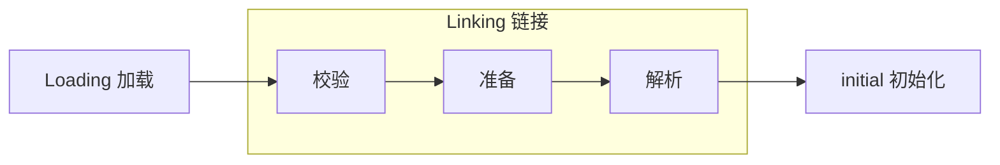

### JVM 结构图

灰色部分是线程私有，不存在线程安全问题，橙色部分为线程共享区


### ClassLoader 类加载器


1. 负责从文件系统或网络中加载Class文件，Class文件开头有特定标识，魔术，咖啡杯壁
2. Classloader只负责class文件的加载，至于是否能运行，则由执行引擎决定
3. 加载的类信息存在方法区中，jdk1.8之后将方法区称为元空间
4. 根据这个Class文件可以实例化出N个一模一样的实例


JVM支持两种类型的加载器，分别为引导类加载器 `BootStrapClassLoader`，引导类加载器底层由c/c++实现，获取时值为 null，和派生于抽象类`ClassLoader`自定义类加载器，对于自定义类来说，默认使用系统类加载器`AppClassLoader`进行加载：

```java

// 自定义类加载器，输出：sun.misc.Launcher$AppClassLoader@18b4aac2
ClassLoader classLoader = JVMTest.class.getClassLoader();
System.out.println(classLoader);

// 系统类加载器，输出：sun.misc.Launcher$AppClassLoader@18b4aac2
ClassLoader appClassLoader = ClassLoader.getSystemClassLoader();
System.out.println(appClassLoader);


// appClassLoader 上层加载器，输出：sun.misc.Launcher$ExtClassLoader@7106e68e
ClassLoader extClassLoader = appClassLoader.getParent();
System.out.println(extClassLoader);


// extClassLoader 上层加载器，输出：null
ClassLoader parent = extClassLoader.getParent();
System.out.println(parent);
```


Java 核心类库使用引导类加载器加载，引导类加载器并不继承java.lang.ClassLoader，没有父加载器，出于安全考虑，Bootstrap启动类加载器只加载包名以java，javax，sun等开头的类：

```java
// 获取 BootStrapClassLoader 能够加载的 api 路径
URL[] urLs = Launcher.getBootstrapClassPath().getURLs();
for (URL urL : urLs) {
    System.out.println(urL);
}

/**
 * file:/D:/Program%20Files/Java/jdk1.8.0_221/jre/lib/resources.jar
 * file:/D:/Program%20Files/Java/jdk1.8.0_221/jre/lib/rt.jar
 * file:/D:/Program%20Files/Java/jdk1.8.0_221/jre/lib/sunrsasign.jar
 * file:/D:/Program%20Files/Java/jdk1.8.0_221/jre/lib/jsse.jar
 * file:/D:/Program%20Files/Java/jdk1.8.0_221/jre/lib/jce.jar
 * file:/D:/Program%20Files/Java/jdk1.8.0_221/jre/lib/charsets.jar
 * file:/D:/Program%20Files/Java/jdk1.8.0_221/jre/lib/jfr.jar
 * file:/D:/Program%20Files/Java/jdk1.8.0_221/jre/classes
 */
```


扩展类加载器ExtClassLoader，派生于ClassLoader，父类加载器为启动类加载器，用于加载`jre/lib/ext`子目录下加载类库：

```java
// 扩展类加载器
String property = System.getProperty("java.ext.dirs");
for (String s : property.split(";")) {
    System.out.println(s);
}

// D:\Program Files\Java\jdk1.8.0_221\jre\lib\ext
// C:\Windows\Sun\Java\lib\ext
```


AppClassLoader 应用程序类加载器 / 系统类加载器 ，负责加载环境变量classpath或系统属性java.class.path指定路径下的类库该类加载器是程序中默认的类加载器，一般来说，Java应用的类都是由它来完成加载：

```java
ClassLoader.getSystemClassLoader();

// 输出 AppClassLoader
```


> 在JVM中，两个Class对象为同一个类必须满足的条件：全类名和加载这个Class的`ClassLoader`必须一致
>
> 
>
> JVM必须知道一个类型是由启动类加载器加载的，还是由用户类加载器加载的，如果是用户类加载器加载的，JVM会将这个类加载器的一个引用作为类型信息的一部分，保存到方法区中


### 双亲委派 / 沙箱安全机制

Java虚拟机对Class文件采用的是按需加载，而且加载class文件时，Java虚拟机使用的是双亲委派模式，即把请求交由父类处理，它是一种任务委派模式，这么做的好处是避免类重复加载，而且可以保护程序安全，防止核心API被篡改：

1. 一个类加载器收到了类加载请求，并不会自己先去加载，而是把这个请求委托给父类的加载器去执行
2. 如果该加载器存在其父类加载器，则进一步向上委托，请求最终将达到顶层的启动类加载器
3. 如果父类的加载器可以完成类加载任务，就成功返回，若父类加载器无法完成此加载任务，子加载器才会尝试自己去加载，这就是双亲委派模式


沙箱安全机制就是保证Java核心源代码不被篡改


### 类加载过程





#### Loading 加载

1. 通过一个类的全限定名获取定义此类的二进制字节流
2. 将这个字节流所代表的静态存储结构转化为方法区的运行时数据结构
3. 在内存中生成一个代表这个类的java.lang.Class对象，作为方法区这个类的各种数据的访问入口


#### Linking 链接

##### 校验

校验的目的为确保Class文件中的字节流中包含信息符合当前虚拟机的要求，保证被加载类的正确性，不会危害虚拟机自身安全，验证主要包括文件格式验证，元数据验证，字节码验证，符号引用验证四种：

| 验证方式     | 验证内容                                                     |
| ------------ | ------------------------------------------------------------ |
| 文件格式验证 | 1. CA FE BA BE(魔数,Java虚拟机识别)<br />2.  主次版本号<br />3. 常量池的常量中是否有不被支持的常量类型<br />4. 指向常量的各种索引值中是否有指向不存在的常量或不符合类型的常量 |
| 元数据验证   | 1. 对字节码描述的信息进行语义分析，保证描述符合Java规范<br />2. 类是否有父类，除了Object之外，所有的类都应该有父类<br />3. 类的父类是否继承了不允许被继承的类，如被final修饰的类<br />4. 如果这个类不是抽象类，是否实现了其父类或接口中要求实现的所有方法<br />5. 类的字段，方法是否与父类产生矛盾，如方法参数都—样，返回值不同 |
| 字节码验证   | 1. 通过数据流分析和控制流分析，确定程序语义是合法的，符合逻辑的<br />2. 对类的方法体，进行校验分析，保证在运行时不会做出危害虚拟机的行为<br />3. 保证任意时刻操作数栈的数据类型与指令代码序列都能配合工作，<br />    不会出现类似于在操作数栈放了一个int类型的数据，<br />    使用时却按照long类型加载到本地变量表中的情况<br />4. 保障任何跳转指令都不会跳转到方法体之外的字节码指令上 |
| 符号引用验证 | 1. 通过字符串描j述的全限定名是否能找到对应的类<br />2.  符号引用中的类、字段、方法的可访问性是香可被当前类访问 |


##### 准备

1. 为`类变量 static 修饰`分配内存并设置该类变量的默认初始值，即零值，如int类型的变量为0，char为`'\u0000'`，引用类型为null等
2. 准备阶段不包含用 `final` 修饰的类变量，因为final在编译的时候就已经被分配了，准备阶段会显式初始化
3. 准备阶段不会为实例变量分配初始化，jdk1.6之前类变量存在方法区中，jdk1.7之后类变量和实例变量都存在堆中


##### 解析

解析就是将常量池内的符号引用转换为直接引用的过程


#### initial 初始化

1. 初始化阶段是执行类构造器方法`<clinit>()`的过程
2. 此方法不需要定义，是`javac`编译器自动收集类中的所有类变量的赋值动作和静态代码块中的语句合并而来，如果没有static修饰的变量或static静态代码块也不会有clinit
3. 构造器方法中指令按照语句在源文中出现的顺序执行
4. `<clinit>()`不同于类的构造器
5. 若该类具有父类，JVM会保证子类的`<clinit>()`执行前，父类的`<clinit>()`已经执行完毕
6. 虚拟机必须保证—个类的`<clinit>()`方法在多线程下被同步加锁


### JVM 运行时数据区


### 程序计数器 / PC 寄存器

PC寄存器用来存储指向下一条指令的地址，即将要执行的指令代码，由执行引擎读取下一条指令：

1. 运行时数据区中唯—不会出现`OOM`和`GC`垃圾回收的区域，占内存空间很小，是运行最快的存储区域
2. 存放当前线程所执行的字节码的行号指示器，为了线程切换后能恢复到正确的位置
3. 线程私有，线程之间互不影响，与线程的生命周期保持一致
4. 如果线程执行的Java方法，则计数器记录正在执行的虚拟机字节码的指令的地址
5. 如果正在执行的本地方法，这个计数器值则应为`undefined`


### 虚拟机栈

> 由于跨平台性的设计，Java的指令都是根据栈来设计的，不同平台CPU架构不同，所以不能设计为基于寄存器
>
> 优点是跨平台，指令集小，编译器容易实现，缺点是性能下降，实现同样的功能需要更多的指令
>
> 
>
> 栈是运行时的单位，而堆是存储的单位，栈解决程序如何执行，如何处理数据，堆解决的是数据存储问题，即数据怎么放，放在哪里，栈只管运行，而堆是存储，栈没有GC，但有OOM


1. Java虚拟机栈，线程私有，内部保存一个个栈帧，对应着一次次的Java方法调用，其生命周期和线程的—致

2. 主管Java程序的运行，保存方法的局部变量，包括8种基本数据类型，对象的引用地址以及部分结果，并参与方法的调用和返回

3. 栈是快速有效的存储方式，访问速度仅次于程序计数器，只有入栈和出栈两个操作

4. 栈不存在GC，但是存在OOM，Java栈大小是可以是动态的也可以是固定不变的，如果是动态扩展，无法申请到足够内存`OOM`，如果是固定，线程请求的栈容量超过固定值，则`StackOverflowError` 

5. 栈中的数据以栈帧格式存储线程上，正在执行的每个方法都各自对应—个栈帧，一个时间点上，只会有一个活动的栈帧

6. 执行引擎运行的所有字节码指令只针对当前栈帧进行操作，如果方法中调用了其他方法，对应的新的栈帧会被创建出来，放在顶端，成为新的当前帧

7. 当前方法调用了其他方法，方法返回之际，当前栈帧会传回此方法的执行结果给前一个栈帧，接着虚拟机会丢弃当前栈帧，使得前一个栈帧重新成为新的栈帧

8. Java中有两种返回方式，一种是正常返回，一种是抛异常，不管哪种方式，都会导致栈帧被弹出

9. 不同线程中包含的栈帧不允许存在相互引用

10. 使用`-Xss`可以设置栈运行时的大小

    


程序不断的进行递归调用，而且没有退出条件，就会导致不断地进行压栈，报`Exception in thread "main" java.lang.StackOverflowError`：

```java
public static void main(String[] args) {
    main(args);
}
```


#### 栈帧内部结构

Java虚拟机栈里存放一个个栈帧，一个栈帧就对应着一个方法

栈帧内部结构分为局部变量表，方法返回地址，操作数栈，动态链接，一些附加信息五个部分


#### 局部变量表

1. 定义为一个数字数组，主要用于存储方法参数，定义在方法体内部的局部变量，包括8种基本数据类型，对象引用，以及returm address类型
2. 局部变量表所需的容量大小是在编译期确定下来的，并保存在方法的Code属性的maximum local variables数据项中，在方法运行期间不会改变局部变量表的大小
3. 方法嵌套调用的次数由栈的大小决定，栈越大，方法嵌套调用次数越多，方法调用结束后，随着方法栈帧的销毁，局部变量表也会随之销毁
4. 方法执行时，虚拟机通过使用局部变量表完成参数值到参数变量列表的传递过程
5. 最基本的存储单元是slot，32位占用一个slot，64位类型(long和double)占用两个slot
6. 只要被局部变量表中直接或间接引用的对象都不会被回收


> 使用 static 修饰的成员变量在 链接的准备阶段赋零值，在初始化阶段显示赋值
>
> 没有 static 修饰的实例变量随着对象的创建，会在堆空间分配实例变量空间，并进行默认赋值
>
> 局部变量在使用前，必须进显式赋值，否则编译不通过


#### 操作数栈

主要用于保存计算过程的中间结果，同时作为计算过程中变量临时的存储空间：

1. 当一个方法刚开始执行的时候，一个新的栈帧也会随之被创建出来，这个方法的操作数栈是空的
2. 每一个操作数栈会拥有一个明确的栈深度，用于存储数值，最大深度在编译期就已经定义好了
3. 若被调用方法带有返回值，其返回值会被压入当前栈帧的操作数栈中，并更新程序计数器中下一条需要执行的字节码指令
4. Java虚拟机的解释引擎是基于栈的执行引擎，其中栈就是操作数栈


> 栈顶缓存技术：由于操作数是存储在内存中，频繁的进行内存读写操作影响执行速度，将栈顶元素全部缓存到物理CPU的寄存器中，以此降低对内存的读写次数，提升执行引擎的执行效率


#### 动态链接

1. 每一个栈帧内部都包含一个指向运行时常量池的方法引用，目的是为当前方法能够实现动态链接
2. 在java源文件被编译成字节码文件中时，所有的变量、方法引用都作为符号引用，保存在class文件的常量池中
3. 常量池在字节码文件中，运行时常量池，在运行时的方法区中
4. 动态链接的作用就是为了将这些符号引用转换为调用方法的直接引用


#### 方法返回地址

1. 存放调用该方法的pc寄存器的值
2. 方法正常退出时，返回地址为PC寄存器的值，即调用该方法的指令的下一条指令的地址
3. 异常退出时，返回地址是通过异常表来确定的，栈帧中一般不会保存这部分信息
4. 通过异常完成出口退出的不会给他的上层调用者产生任何的返回值


#### 一些附加信息

栈帧中还允许携带与Java虚拟机实现相关的一些附加信息，如对程序调试提供支持的信息


> 栈相关面试题：
>
> 1. 举例栈溢出 StackOverflowError 的情况
>
>    通过`-Xss`设置栈的大小
>
> 2. 调整栈大小，就能保证不出现溢出吗
>
>    不能，调整大了只是晚一点出现OOM而已
>
> 3. 分配的栈内存越大越好吗
>
>    不是，栈大了其他会小
>
> 4. 垃圾回收是否会涉及到虚拟机栈
>
>    不会，只有出入栈两个操作
>
> 5. 方法中定义的局部变量是否线程安全
>
>    具体问题具体分析，如果方法中的局部变量被返回给其他方法使用会出现线程安全问题
>
>    ```java
>    // 以下方式存在线程安全问题
>    public StringBulider getString() {
>        StringBulider builder = new StringBulider();
>        for (int i = 0; i < 10; i ++) {
>            builder.append(i);
>        }
>        return builder;
>    }
>                            
>    // 可以使用这种方式避免
>    public String getString() {
>        StringBulider builder = new StringBulider();
>        for (int i = 0; i < 10; i ++) {
>            builder.append(i);
>        }
>        return builder.toString();
>    }
>    ```


### 本地方法栈

本地方法就是使用 native 关键字修饰的方法，由C/C++实现，Java虚拟机栈管理Java方法的调用，而本地方法栈用于管理本地方法的调用：

1. 允许被实现成固定或者是可动态扩展的内存大小，内存溢出情况和Java虚拟机栈相同
2. 当某个线程调用一个本地方法时，就会进入一个全新，不受虚拟机限制的世界，它和虚拟机拥有同样的权限
3. 并不是所有的JVM都支持本地方法，因为Java虚拟机规范并没有明确要求本地方法栈的使用语言，具体实现方式，数据结构等
4. Hotspot JVM中，直接将本地方法栈和虚拟机栈合二为一


### 堆


1. —个JVM实例只存在一个堆内存，堆也是Java内存管理的核心区域
2. Java堆区在JVM启动的时候即被创建，其空间大小也就确认了
3. 堆内存的大小是可调节的，`-Xms1024m -Xmx1024m `，Xms 设置初始值，Xmx 设置最大值，超过最大值会报OOM，一般这两个值都被设置成一样，目的是 GC 后，不用重新分隔计算堆区的大小，从而提高性能
4. 默认情况下，堆初始值为 物理内存/64，最大值为 物理内存/4
5. 堆在物理上是不连续的内存空间
6. 所有的线程共享Java堆，而且这里还有划分线程私有的`TLAB`缓冲区
7. 几乎所有的对象实例都在这里分配内存
8. 数组和对象可能永远不会存储在栈上，因为栈帧中保存引用，引用指向对象或者数组在堆中的位置
9. 方法结束后，堆中的对象不会马上被移除，仅仅在垃圾收集的时候才会被移除
10. 堆是GC执行垃圾回收的重点区域
11. `jps`查看运行的进程，`jstat -gc 进程号`查看JVM在GC时的统计信息


> `-Xms1024m -Xmx1024m -XX:+PrintGCDetails`  ：可打印堆的详细信息


#### 堆空间分代思想

分代的目的是优化GC性能，jdk1.7 之前堆分为年轻代，老年代，永久代/方法区


jdk1.8 之后堆分为年轻代，老年代，元数据，即将永久代 ->  元数据


#### 年轻代和老年代


1. 新生代与老年代空间默认比例1：2，`-XX:NewRatio=2`，表示新生代占1，老年代占2，新生代占整个堆的1/3
2. 在新生代中，三个区的比例分别为 8：1：1，其中Eden占8份其余各占1份，`-XX:SurviveRatio` 可以修改新生代三个区的比例，默认值为8，但实际上是6：1：1，要想变回8可以显示加上jvm参数 -XX:SurviveRatio=8
3. 可以使用 `-Xmn` 设置新生代的内存大小，若同时存在 -Xmn 和 XX:NewRatio 则以 -Xmn 为准，但一般不设置 -Xmn
4. 几乎所有的Java对象都是在Eden区被new出来的，若Eden GC之后还是没有足够空间放对象，则直接进入老年代，若老年代也放不下则会进行`Major GC / Full GC`，GC之后仍没有足够的空间则报OOM
5. Eden区满的时候会触发GC，Survive区满时不会GC，Survive区的GC是在Eden区满的时候进行GC时一起回收，Survive区属于被动回收
6. Eden区满的时候会触发GC，这种GC成为`YGC`，YGC会把幸存的对象通过复制算法放到To区
7. 在执行YGC时，会把幸存的对象放入Survive区，幸存的对象来自Eden区和Survive区，Survive中哪个区为空就放入哪个区，空的那个Survive区也称为To区，另一个不为空的Survive区则为From区，放入To区之后这个区就变为From区，原来的From区为空就变成了To区


#### 内存分配策略

1. 优先分配到Eden，大对象直接分配到老年代
2. 如果对象在Eden出生并经过第一次MinorGC/YGC后仍然存活，并且能被Survivor区容纳，则被移动到Survivor空间中，并将对象年龄设置为1，对象在Survivor区每熬过一次MinorGC，年龄就+1，当年龄增加到一定程度(默认为15，不同Jvm，GC都所有不同)时，就会被晋升到老年代中，可以使用 `-XX:MaxTenuringThreshold` 设置年龄阈值
3. 动态对象年龄分配：如果Survivor区中相同年龄的所有对象大小的总和大于Survivor空间的一半，年龄大于或等于该年龄的对象可以直接进入老年代，无需等到MaxTenuringThreshold中要求的年龄
4. 空间分配担保：`-XX:HandlePromotionFailure`


#### 空间分配担保机制

在YGC之前，虚拟机会检查老年代最大可用的连续空间是否大于新生代所有对象的总空间：

1. 若大于，则此次YGC安全
2. 若小于，则会查看是否允许担保失败 `HandlePromotionFailure=true`，那么会继续检查老年代最大可用连续空间是否大于历次晋升到老年代的对象的平均大小，若大于则尝试进行一次YGC，但这次YGC依然有风险，若小于或者`HandlePromotionFailure=false`，则进行一次Full GC


因为新生代采用复制收集算法，假如大量对象在Minor GC后仍然存活，最极端情况为内存回收后新生代中所有对象均存活，而Survivor空间是比较小的，这时就需要老年代进行分配担保，把Survivor无法容纳的对象放到老年代

老年代要进行空间分配担保，前提是老年代得有足够空间来容纳这些对象，但一共有多少对象在内存回收后存活下来是不可预知的，因此只好取之前每次垃圾回收后晋升到老年代的对象大小的平均值作为参考，使用这个平均值与老年代剩余空间进行比较，来决定是否进行Full GC来让老年代腾出更多空间


#### 对象分配过程


#### MinorGC/YGC，MajorGC，FullGC 触发条件

| MinorGC/YGC                                                  | 老年代GC MajorGC/FullGC                                      | FullGC                                                       |
| ------------------------------------------------------------ | ------------------------------------------------------------ | ------------------------------------------------------------ |
| 1. 年轻代中Eden区空间不足时触发，Survivor满不会触发GC<br />2. MinorGC会引发STW | 1. 出现了MajorGC，经常会伴随至少—次MinorGC，也就是老年代空间不足，会先尝试触发MinorGC，如果之后空间还不足，则触发MajorGC<br />2. MajorGC的速度比MinorGC慢10倍以上，STW的时间更长，如果MajorGC后，内存还不足，就报OOM | 1. 调用System.gc()时，系统建议执行FullGC，但是不一定执行<br/>2. 老年代空间不足<br/>3. 方法区空间不足<br/>4. 通过MinorGC后进入老年代的平均大小，大于老年代的可用内存<br/>5. 由Eden区，Survivor 0区向Survivor 1区复制时，对象的大小大于ToSpace可用内存，则把改对象转存到老年代，且老年代的可用内存小于该对象的大小<br />6. FullGC是开发或调优中尽量要避免的，这样暂停时间会短一些 |


#### TLAB

JVM在Eden内为每个线程分配了—个私有缓存区域，该区域称为 TLAB Thread Local Allocation Buffer：

1. 堆区是线程共享区域，任何线程都可以访问到堆区的共享数据，由于对象实例的创建在JVM中非常频繁，因此在并发环境下从堆区中划分内存空间是线程不安全的
2. 多线程同时分配内存时，使用TLAB可以避免一系列的非线程安全问题，同时还能够提升内存分配的吞吐量
3. 尽管不是所有的对象实例都能够在TLAB中成功分配内存，但是JVM确实是将TLAB作为内存分配的首选
4. 通过`-XX:UseTLAB`设置是否开启TLAB空间
5. TLAB空间内存非常小，仅占有整个Eden空间的1%，通过`-XXTLABWasteTargetPercent`设置TLAB空间所占用Eden空间的百分比大小
6. 一旦对象在TLAB空间分配内存失败，JVM就会尝试通过使用加锁机制确保数据操作的原子性，直接在Eden空间中分配内存


#### 堆空间参数设置

[官网](https://docs.oracle.com/javase/8/docs/technotes/tools/unix/java.html) 

1. -XX:+PrintFlagsInitial：查看所有的参数的默认初始值
2. -XX:+PrintFlagsFinal：查看所有的参数的最终值，可能会存在修改，不再是初始值
3. -Xms：初始堆空间内存，默认为物理内存的1/64
4. -Xmx：最大堆空间内存，默认为物理内存的1/4
5. -Xmn：设置新生代的大小，初始值及最大值
6. -XX:NewRatio：配置新生代与老年代在堆结构的占比
7. -XX:SurvivorRatio：设置新生代中Eden和s0/s1空间的比例
8. -XX: MaxTenuringThreshold：设置新生代垃圾的最大年龄
9. -XX:+PrintGCDetails：输出详细的GC处理日志
10. -XX:+PrintGc  /  -verbose: gc  打印GC简要信息
11. -XX:HandlePromotionFailure：是否设置空间分配担保


#### 逃逸分析

对象一般都会分配到堆上，但随着JIT编译器的发展与逃逸分析技术逐渐成熟，栈上分配、标基替换优化技术，如果经过逃逸分析后发现，一个对象并没有逃逸出方法的话，那么就可能被优化成找上分配，这样无需堆上分配，也不需要垃圾回收了，也是最常见的堆外存储技术


当一个对象在方法中定义后，对象只在方法内部使用，则认为没有发生逃逸，若它被外部方法引用，则认为发生逃逸，例如作为调用参数传递到其他地方中


栈上分配：将堆分配转为栈分配，如果一个对象在子程序中被分配，要使指向该对象的指针永远不会逃逸，对象可能是栈分配的候选，而不是堆分配


同步省略：JIT编译器可以借助逃逸分析来判断同步块所使用的的锁对象，是否只能够被一个线程访问，而没有被发布到其他线程。如果没有，那么JIT编译器在编译这个同步块的时候，就会取消对这部分代码的同步，这样就大大提高并发性和性能，这个取消同步的过程就叫同步省略，也叫锁消除


分离对象/标量替换：

1. 有的对象可能不需要作为一个连续的内存结构存在，也可以被访问到，那么对象的部分或全部可以不存储在内存，而是存储在CPU寄存器中标星是指一个无法再分解的更小的数据的数据，
2. Java中原始数据类型就是标量，可以分解的数据叫聚合量，Java中的对象就是聚合量，因为他可以分解成其他聚合量和标量
3. 标量替换参数：-XX:EliminateAllocations，默认打开


### 方法区


1. 方法区在JVM启动的时候被创建，并且它的实际的物理内存空间和Java堆区一样，都是可以不连续的
2. 方法区的大小和堆空间—样，可以选择固定大小或者可扩展
3. 方法区的大小决定了系统可以保存多少个类，如果定义太多类，加载大量的第三方的Jar包，Tomcat部署过多工程，导致方法区溢出，虚拟机同样会抛出内存溢出OOM: PermGen space或者Metaspace
4. 关闭JVM就会释放这个区域的内存


元空间的本质和永久代类似，都是对JVM规范中方法区的实现，不过元空间与永久代最大的区别在于元空间不在虚拟机设置的内存中，而是使用本地内存，方法区大小不是固定的，jvm可以根据应用动态调整：

| JDK1.7前                                                     | JDK1.8后                                                     |
| ------------------------------------------------------------ | ------------------------------------------------------------ |
| 1. 通过`-XX:PermSize`来设置永久代初始分配空间，默认值是20.75M<br />2. 通过`-XX:MaxPermSize`来设定永久代最大可分配空间，32位机器默认是64M，64位默认是82M<br />3. 如果JVM加载的类信息容量超过了这个值，会报OOM:PermGen space | 1. 可以使用参数`-XX:MetaspaceSize`设置初始元空间大小<br />2. `-XX:MaxMetaspaceSize`设置元空间最大值<br />3. 如果元数据区发生溢出，虚拟机一样会抛出异常outOfMemoryError: Metaspace |


使用CGLib使得方法区出现内存溢出异常

```java
/**
 * JVM1.7 Args： -XX:PermSize=10M -XX:MaxPermSize=10M
 * JVM1.8 Args： -XX:MetaspaceSize=10M -XX:MaxMetaspaceSize=10M
 */
public class JavaMethodAreaOOM {
    public static void main(String[] args) {
        while (true) {
            Enhancer enhancer = new Enhancer();
            enhancer.setSuperclass(OOMObject.class);
            enhancer.setUseCache(false);
            enhancer.setCallback(new MethodInterceptor() {
                public Object intercept(Object obj, Method method,
                        Object[] args, MethodProxy proxy) throws Throwable {
                    return proxy.invokeSuper(obj, args);
                }
            });
            enhancer.create();
        }
    }
    static class OOMObject {
    }
}
```


解决OOM方法：

1. 要解决OOM或heap space异常，一般的手段是通过内存映像分析工具，对dump出来的堆转存储快照进行分析，重点确认内存中的对象是否是必要的，也就是要先分清楚到底是出现了内存泄露，还是内存溢出
2. 如果是内存泄露，可进一步通过工具查看泄露对象到GC Roots的引用链，找到内存泄露对象时通过怎样的路径与GC Roots相关联，导致垃圾收集器无法自动回收他们。根据引用链信息，可以较准确的定位出泄露代码的位置
3. 如果不存在内存泄露，或者说内存中的对象确实都还必须存活着，那就应当检查虚拟机的堆参数（-Xmx与-Xms)，与物理机器内存对比是否还可以调大，从代码检查是否某些对象生命周期过长，持有状态时间过长，尝试减少程序运行时的内存耗用


#### 方法区内部结构

方法区用于存储已被虚拟机加载的类型信息，常量，静态变量，即时编译器编译后的代码缓存

| 内部结构                    | 描述                                                         |
| --------------------------- | ------------------------------------------------------------ |
| 类型信息                    | 包括类的类型 `class / interface / enum / annotation `，全类名，类型修饰符 `public / abstract / final`，直接父类或直接接口的有序列表等 |
| 域信息 /  bean 中的成员变量 | JVM必须在方法区中保存类型的所有域的相关信息，以及域的声明顺序，包括域名称、域类型、域修饰符 |
| 方法信息                    | 和域信息一样包括声明顺序，方法修饰符，返回类型，方法名称，参数列表及其类型，方法的字节码bytecodes，操作数栈，局部变量表及大小，异常表等，<br />每个异常处理的开始位置，结束位置，代码处理在程序计数器中的偏移地址，被捕获的异常类的常量池索引，abstract和native方法除外 |
| 非final的static变量         | 静态变量和类关联在—起，随着类的加载而加载，类变量被类的所有实例共享，即使没有类实例也可以访问 |
| static final     全局常量   | 被声明为final的类变量在编译的时候就会被分配                  |
| 运行时常量池                | 1. 常量池是class文件的一部分，用于存放编译期生成的各种字面量和符号引用，这部分内容将在类加载后存放到方法区的运行时常量池中<br />2. JVM为每个已加载的类型都维护一个常量池，池中的数据像数组—样，通过索引访问<br />3. 运行时常量池包含多种不同的常量，包括编译期就已经明确的数值字面量，也包括到运行期解析后，才能够获得的方法或者字段引用，此时不再是常量池中的符号地址了，这里转换为真实地址<br />4. `String.intern()`方法可以将字符串也放入运行时常量池 |


方法区常量池主要存放两大常量：

| 类型     | 描述                                                       |
| -------- | ---------------------------------------------------------- |
| 字面量   | 如文本字符串 ，被声明为final的常量值等                     |
| 符号引用 | 类和接口的全限定名，字段的方法和描述符，方法的名称和描述符 |


#### JDK6/7/8方法区的变化

| JDK版本 | 描述                                                         |
| ------- | ------------------------------------------------------------ |
| 1.6之前 | 有永久代 permanent generation，静态变量存放在永久代上        |
| 1.7     | 有永久代，但己经逐步去永久代，而且字符串常量池、静态变量保存在堆中 |
| 1.8     | 无永久代，类型信息、字段、方法、常量保存在`本地内存`的元空间，但字符串常量池、静态变量仍在堆 |


1. JDK1.8的方法区和之前的版本最大的不同就是将方法区移除，转而保存在本地内存，有些数据被转移到了一个与堆不相连的本地内存区域，这个区域叫做元空间MetaSpace
2. 由于类的元数据分配在本地内存中，元空间的最大可分配空间就是系统的可用内存空间，而元空间并不在虚拟机中，而是使用本地内存，因此默认情况下，元空间的大小仅受本地内存限制
3. JDK1.7中将stringTable放到了堆空间中，因为永久代在full gc的时候才会触发，而full gc是老年代的空间不足、永久代不足时才会触发，这就导致stringTable回收效率不高，开发中会有大量的字符串被创建，回收效率低，导致永久代内存不足，放到堆里，能及时回收内存


#### StringTable / 字符串常量池

JDK1.7之后就将 静态变量和StringTable从方法区中移除，放到了堆里，因为方法区是Full GC的时候才会触发垃圾回收，而且方法区空间较小，大量的字符串容易导致OOM，如果不能及时回收会导致方法区空间不足，为了能及时回收所以就放到了堆里

1. 常量与常量的拼接结果在常量池中，原理是编译期优化，而且常量池中不存在相同内容的常量

   ```java
   public void main(String[] args) {
       // ab 在常量池中只存一份
       String s1 = "a" + "b";
       String s2 = "ab";
       // true
       System.out.println(s1 == s2);
   }
   ```


2. 只要其中有一个变量，拼接结果就在堆中（常量池以外的堆)，变量的拼接原理是StringBuilder

   ```java
   public void main(String[] args) {
       String s1 = "a";
       String s2 = "b";
       String s3 = "ab";
       // 拼接了变量
       String s4 = s1 + s2;
       // false
       System.out.println(s3 == s4);
   }
   ```

   

3. 如果拼接的结果调用`intern`方法，则主动将常量池中还没有的字符串对象放入池中，并返回此对象地址

   ```java
   public void main(String[] args) {
       String s1 = "a";
       String s2 = "b";
       String s3 = "ab";
       // 调用 intern 方法
       String s4 = (s1 + s2).intern();
       // true
       System.out.println(s3 == s4);
   }
   ```

   

4. 如果使用 final 修饰，JVM会优化成常量

   ```java
   public static void main(String[] args) {
       // 使用 final 修饰
       final String s1 = "a";
       final String s2 = "b";
       
       String s3 = "ab";
       
       // 这条语句会被JVM优化成：String s4 = "a" + "b";
       String s4 = s1 + s2;
       // true
       System.out.println(s3 == s4);
   
   }
   ```

   


#### 方法区的垃圾回收

一般来说方法区的回收效果比较难令人满意，尤其是类型的卸载，条件相当苛刻，但是这部分区域的回收有时又确实是必要的，方法区的垃圾收集主要回收两部分内容:常量池中废弃的常量和不再使用的类型：

| 回收内容           | 允许被回收的条件                                             |
| ------------------ | ------------------------------------------------------------ |
| 常量池中废弃的常量 | 只要常量池中的常量没有被任何地方引用，就可以被回收           |
| 不在使用的类型     | 1. 该类所有的实例已经被回收<br/>2. java堆中不存在该类及其任何派生子类的实例<br/>3. 加载该类的类加载器已经被回收<br/>4. 该类对应的java.lang.Class对象没有在任何地方被引用，无法在任何地方通过反射访问改类的方法 |


在大量使用反射，动态代理，CGLib等字节码框架，动态生成JSP以及OSGI这类频繁自定义类加载器的场景中，通常都需要Jva虚拟机具备类型卸载的能力以保证不会对方法区造成过大的内存压力


### 执行引擎


JVM的主要任务是负责装载字节码到其内部，但字节码并不能够直接运行在操作系统之上，它内部包含的仅仅只是一些能够被JVM所识别的字节码指令、符号表，以及其他辅助信息

如果想要让一个Java程序运行起来，则需要执行引擎 Execution Engine 将字节码指令解释/编译为对应平台上的本地机器指令


1. 执行引擎在执行的过程中究竟需要执行什么样的字节码指令完全依赖于Pc寄存器
2. 每当执行完一项指令操作后，PC寄存器就会更新下一条需要被执行的指令地址
3. 方法在执行的过程中，执行引擎有可能会通过存储在局部变量表中的对象引用准确定位到存储在Java堆区中的对象实例信息，以及通过对象头中的元数据指针定位到目标对象的类型信息


执行引擎中有解释器和JIT编译器，绿色为解释器执行流程，蓝色为JIT编译器执行流程，通常在执行Java代码时都会将二者结合起来，所以称Java是半编译半执行语言


#### 解释器

1. 一种古老的字节码解释器，当Java虚拟机启动时，会根据预定义的规范对字节码采用`逐行解释`的方式执行，将字节码文件中的内容翻译为对应的平台的本地机器指令执行
2. 当一条字节码指令被解释执行完成后，接着在根据PC寄存器中的记录下一条需要被执行的字节码执行解释执行
3. 现在普遍使用模板解释器，模板解释器将每一条字节码和一个模板函数相关联，模板函数直接产生这条字节码执行时的机器码，提高解释器的性能


#### JIT编译器

就是虚拟机将源代码直接编译成和本地机器平台相关的机器语言，JVM平台支持一种叫做即时编译的技术，目的是避免解释执行，而是将整个函数体编译成机器码，每次函数执行时，只执行编译后的机器码即可，使执行效率大幅提升


> 解释器和JIT编译器共存的原因：
>
> 1. 解释器解释速度快，但执行速度慢，而JIT编译器需要先将字节码编译后才能执行，编译需要时间，但JIT编译器执行速度快
> 2. 首先程序启动后，解释器可以马上发挥作用，省去编译时间，立即执行
> 3. 随着时间的推移，JIT编译器发挥作用，把越来越多的代码编译成本地代码，以获得更高的执行效率


### Garbage Collection

1. 运行的程序中没有任何指针指向的对象，这个对象就是需要被回收的对象，也称为垃圾，若不能及时清理，那么这些垃圾就会一直保存在内存中，可能会导致OOM
2. 除了释放没用的对象，垃圾回收也可以清除内存里的记录碎片，碎片整理将所占用的堆内存移到堆的一端，以便JVM将整理出的内存分配给新的对象
3. 频繁GC会造成卡顿，因为每次GC都会伴随STW，STW会阻塞用户线程，所以才会不断地尝试对GC进行优化
4. 堆是GC的重点区域，也可以对方法区回收，从次数上讲应频繁收集Young区，较少收集Old区，基本不动方法区


判断对象是否存活有两种方式：引用计数法和可达性分析算法


### GC标记垃圾算法


#### 引用计数算法

引用计数算法 Reference Counting，对每个对象保存一个整型的引用计数器属性，用于记录对象被引用的情况


对于一个对象A，只要有任何一个对象引用了A，则A的引用计数器就加1，当引用失效时，引用计数器就减1，只要对象A的引用计数器的值为0，即表示对象A不可能再被使用，可进行回收


优点：实现简单，垃圾对象便于辨识;判定效率高，回收没有延迟性

缺点：

1. 需要单独的字段存储计数器，增加了存储空间的开销
2. 每次赋值都需要更新计数器，伴随着加法和减法操作，增加了时间开销
3. 引用计数器无法处理循环引用的情况，导致在Java的垃圾回收器中没有使用这类算法


#### 可达性分析算法

也叫作追踪性垃圾收集，是Java选择的标记算法，不仅同样具备实现简单和执行高效等特点，而且可以有效地解决在引用计数算法中循环引用的问题，防止内存泄漏的发生：

1. 以根对象 GC Roots 为起始点，按照从上到下的方式搜索被根对象集合所连接的目标对象是否可达
2. 内存中存活的对象都被被根对象集合直接或间接连接着，搜索所走过的路径称为引用链
3. 如果目标对象没有任何引用链相连，则是不可达的，可以标记为垃圾对象


GC Roots 包括：

1. 虚拟机栈中引用的对象，如各个线程被调用的方法中使用到的参数、局部变量
2. 方法区中静态属性引用的对象，如Java类的引用类型静态变量
3. JNI handles，即本地方法
4. 方法区中常量引用的对象，如字符串常量池 StringTable 里的引用
5. 所有被同步锁synchronized持有的对象
6. 已启动且未停止的 Java 线程


> 由于Root采用栈方式存放变量和指针，所以如果一个指针，它保存了堆内存里面的对象，但是自己又不存放在堆内存里面，那它就是一个Root 


#### 三色标记法

三色标记法，根据可达性分析，从 GC Roots 开始进行遍历访问，按是否访问过标记为白灰黑三种颜色：

1. 白色：没有被访问过，即要回收的垃圾对象
2. 灰色：对象被访问过，但本对象引用到的其他对象没有被全部访问，当本对象引用到的其他对象全部都被访问到后，会变为黑色
3. 黑色：对象被访问过，并且本对象引用到的其他对象全都被访问过


其遍历访问过程为：

1. 首先创建三个集合，白灰黑
2. 初始时，所有对象都在白色集合中
3. 将 GC Roots 直接引用到的对象挪到 灰色集合中
4. 从灰色集合中获取对象：
   - 将本对象引用到的其他对象全部挪到灰色集合中
   - 将本对象挪到黑色集合里面
5. 重复步骤4，直至灰色集合为空时结束
6. 结束后，仍在白色集合的对象即为 GC Roots 不可达，可以进行回收


##### 多标，浮动垃圾


多标意思是指，某个对象已经被标记为灰色了，但其上一个引用他的对象突然将引用断开，这个对象应该是要被回收的，然而这个对象是灰色的，其仍会被当作存活对象继续遍历下去，最终的结果是，这部分对象仍会被标记为存活，即本轮 GC 不会回收这部分内存

这部分本应该回收 但是没有回收到的内存，被称之为浮动垃圾，浮动垃圾并不会影响应用程序的正确性，只是需要等到下一轮垃圾回收中才被清除

另外，针对并发标记开始后的新对象，通常的做法是直接全部当成黑色，本轮不会进行清除。这部分对象期间可能会变为垃圾，这也算是浮动垃圾的一部


##### 漏标


假设 GC 线程已经遍历到 E，E变为灰色，此时应用线程先执行了：

```java
G G = E.G; 
E.G = null;  // 灰色E 断开引用 白色G 
D.G = G;  // 黑色D 引用 白色G
```

切回 GC 线程时，因为 E 已经没有对 G 的引用了，所以不会将 G 放到灰色集合，尽管 D 重新引用了 G，但因为 D 已经是黑色了，不会再重新做遍历处理，G 会一直停留在白色集合中，最后被当作垃圾进行清除，这直接影响到了应用程序的正确性

漏标只有同时满足以下两个条件时才会发生：

1. 灰色对象断开了白色对象的引用
2. 黑色对象重新引用了该白色对象


##### CMS解决漏标问题

写屏障+批量更新方式，在并发标记阶段，黑色对象D关联白色对象G时，记录下D黑色对象， 在重新标记阶段时，将D对象变为灰色对象，并遍历整个引用链
 缺点：遍历整个链的效率非常低，有可能会导致用户线程等待的时间非常长


##### G1解决漏标问题

写屏障 + SATB，在灰色对象E断开和白色对象G的引用时，记录原始快照，在重新标记阶段将白色对象G变为灰色对象，并从这个对象开始往下继续扫描，本次GC时，G对象不会被清理

好处：无需做任何遍历效率是非常高
缺点：若黑色对象没有引入该白色对象，白色对象在本次GC继续存活，只能放在下一次GC在做并发标记的时候清理


##### ZGC解决漏标问题

读屏障


#### 对象的finalization机制

1. Java提供了对象终止finaliztion机制来允许开发人员提供对象被销毁之前的自定义处理逻辑
2. 垃圾回收此对象之前，总会先调用这个对象的`finalize ()`方法，finalize ()方法允许在子类中被重写，用于在对象被回收时进行资源释放，如数据库链接等
3. 不要主动调用某个对象的finalize ()方法，应该交给垃圾回收机制调用，因为在`finalize ()`时可能会导致对象复活，而且finalize ()方法的执行时间是没有保障的，它完全由GC线程决定，极端情况下，若不发生GC，则finalize ()方法将没有执行机会，不合理调用的finalize ()会严重影响GC的性能


由于`finalize ()`方法的存在，虚拟机中的对象一般处于三种可能的状态：

1. 可触及的：从根节点开始，可以到达这个对象

2. 可复活的：对象的所有引用都被释放，但是对象有可能在finalize()中复活，如：

   ```java
   @Override
   protected void finalize() throws Throwable {
       super.finalize();
       // obj = this;
   }
   ```

3. 不可触及的：对象的finalize ( )被调用，并且没有复活，那么就会进入不可触及状态，不可触及的对象不可能被复活，因为finalize()只会被调用一次


### GC清除垃圾算法

#### 清除阶段-标记清除

1. 标记：从引用根节点开始遍历，标记所有被引用的对象，一般是在对象Header中记录为可达对象，注意标记的是引用对象，不是垃圾对象
2. 清除：对堆内存从头到尾进行线性的遍历，如果发现某个对象在其Header中没有标记为可达对象，则将其回收


缺点：效率不算高，在GC的时候，需要停止整个应用程序，而且这种方式清理出来的空闲内存不连续，产生内存碎片，需要维护一个空闲列表


> 所谓的清除并不是真的置空，而是把需要清除的对象地址保存在空闲的地址列表里，下次有新对象需要加载时，判断垃圾的位置空间是否够，如果够就覆盖


#### 清除阶段-复制算法


将活着的内存空间分为两块，每次只使用其中一块，在垃圾回收时将正在使用的内存中的存活对象复制到未被使用的内存块中，之后清除正在使用的内存块中的所有对象，交换两个内存的角色，最后完成垃圾回收


优点：实现简单高效，复制过去以后的保证空间的连续性，不会出现碎片的问题

缺点：需要两倍的内存空间，使用了复制而不是移动，时间开销也不小


如果系统中的垃圾对象很多，复制算法需要复制的存活对象数量并不会太大，或者说非常低才行，即特别适合垃圾对象很多，存活对象很少的场景，如Young区的Survivor0和Survivor1区


#### 清除阶段-标记-压缩算法

1. 标记-压缩算法也称标记整理算法，第一个阶段和标记清除算法—样，从根节点开始标记所有被引用的对象，第二阶段将所有的存活对象移动到内存的一端，按照内存地址依次排放
2. 之后将后面的内存全部回收
3. 与标记清除算法本质区别：标记清除算法是非移动式的算法，标记压缩是移动式的


优点：消除了标记清除算法内存区域分散的缺点，消除了复制算法中，内存减半代价，从效率上来讲，标记整理算法要低于复制算法

缺点：移动对象的同时，如果对象被其他对象引用，则还需要调整引用的地址，移动的过程中，需要全程暂停用户应用程序，即STW


#### 三种算法对比

|          | Mark-Sweep<br />标记清除 | Mark-Compact<br />标记-压缩 | Copying<br />复制算法                     |
| -------- | ------------------------ | --------------------------- | ----------------------------------------- |
| 速度     | 中等                     | 最慢                        | 最快                                      |
| 空间开销 | 少，但会堆积碎片         | 少，但不会堆积碎片          | 通常需要存活对象的2倍大小<br />不堆积碎片 |
| 移动对象 | 否                       | 是                          | 是                                        |


#### 分代收集算法

不同生命周期的对象可以采取不同额收集方式，以便提高回收效率，几乎所有的GC都采用分代收集算法执行垃圾回收


HotSpot中，年轻代生命周期短，存活率低，回收频繁，老年代区域较大，生命周期长，存活率高，回收不及年轻代频繁


#### 增量收集算法

每次垃圾收集线程只收集一小片区域的内存空间，接着切换到应用程序线程，依次反复，直到垃圾收集完成，通过对线程间冲突的妥善管理，允许垃圾收集线程以分阶段的方式完成标记、清理或复制工作


缺点：线程和上下文切换导致系统吞吐量的下降


#### 分区算法

为了控制GC产生的停顿时间，将一块大的内存区域分割成多个小块，根据目标的停顿时间，每次合理的回收若干个小区间，而不是整个堆空间，从而减少GC所产生的时间

分代算法是将对象按照生命周期长短划分为两个部分，分区算法是将整个堆划分为连续的不同的小区间每一个小区间都独立使用，独立回收，这种算法的好处是可以控制一次回收多少个小区间


### GC 方法

在默认情况下，通过调用 `System.gc()`或者`Runtime. getRuntime().gc()`，会显式触发Full GC，但无法保证对垃圾收集器的调用


### 内存溢出与内存泄漏


内存溢出 OOM：java虚拟机的堆内存设置不够或代码创建大量大对象，并且长时间不能被垃圾收集器收集

内存泄漏：对象不在被程序使用，但是GC又不能回收的情况，如单例的生命周期和程序是一样长，如果单例程序中，持有对外部对象的引用的话，那么这个外部对象是不能被回收的，导致内存泄露，或者—些提供close的资源未关闭导致内存泄露，如数据库链接，网络链接，和IO


### 安全点与安全区域

1. 程序执行并非在所有地方都能停顿下来开始GC，只有特定的位置才能停顿下来开始GC，这些位置称为安全点
2. 如果安全点太少，导致GC等待时间长，如果太多导致运行时性能问题，大部分指令执行都比较短，通常会根据是否具有让程序长时间执行的持征为标准选择一些执行时间较长的指令作为安全点，比如方法调用，循环跳转和异常跳转等


### 四种引用

|            |                                                              |
| ---------- | ------------------------------------------------------------ |
| 强引用     | 1. 如 `new Object()` ，无论任何情况下，垃圾收集器永远不会回收掉被引用的对象<br />2. 强引用是造成java内存泄露的主要原因之一 |
| 软引用     | 1. 系统将要发生内存溢出之前，会将这些对象列入回收范围之中进行第二次回收，如果这些回收后还没有足够内存，才会抛出内存溢出异常<br />2. 软引用通常用来实现内存敏感的缓存，高速缓存就有用到软引用<br/>3. 垃圾回收器在某个时间决定回收软可达的对象的时候，会清理软引用，并可选的把引用存放到一个引用队列<br />4. 当堆中内存足够时，不回收软引用，不足时才进行回收 |
| 弱引用     | 当垃圾收集器工作时，无论内存空间是否足够，都会回收掉被弱引用关联的对象 |
| 虚引用     | 1. 一个对象是否有虚引用存在，完全不会对其生存时间构成影响，虚引用唯一目的就是在这个对象被收集器回收时收到一个系统通知<br/>2. 他不能单独使用，也无法通过虚引用获取被引用的对象。 |
| 终结器引用 | 1. 用以实现对象的finalize方法，所以被称为终结器引用<br/>2. 无需手动编码，其内部配合引用队列使用<br/>3. GC时，终结器引用入队，由finalize线程通过终结器引用找到被引用对象并调用他的finalize方法，第二次GC时才能回收被引用对象 |


### GC 垃圾回收器


垃圾回收器分类：

1. 按线程数分，可以分为串行垃圾回收器和并行垃圾回收器，串行用于单核CPU比较合适，并行可以提高吞吐量，不过并行回收仍然与串行回收—样，采用独占式，使用了STW机制，此时工作线程被暂停，直到垃圾收集工作结束

   

2. 按照工作模式分，可以分为并发式垃圾回收器和独占式垃圾回收器，并发式垃圾回收器与应用程序线程交替工作，以尽可能减少应用程序的停顿时间，独占式垃圾回收器(Stop the world)一旦运行，就停止应用程序中的所有用户线程，直到垃圾回收过程完全结束

   

3. 按碎片处理方式，可以分为压缩式和非压缩式，压缩式垃圾回收器会在回收完成后，对存活对象进行压缩整理，消除回收后的碎片，非压缩式的垃圾回收器不进行这步操作

4. 按个工作内存区间分，年轻代及老年代


#### GC的性能指标

1. `吞吐量`：运行用户代码的时间占总运行时间的比例，总运行时间 = 程序的运行时间+内存回收的时间，吞吐量优先，意味着单位时间内，STW的时间最短
2. `暂停时间`：执行垃圾收集时，程序的工作线程被暂停的时间，暂停时间优先意味着单次STW的时间最短，但是暂停频率可能增加
3. `内存占用`：Java堆区所占的内存大小
4. 垃圾收集开销：吞吐量的补数，垃圾收集所占用的时间与总运行时间的比例
5. 收集频率：相对于应用程序的执行，收集操作发生的频率
6. 快速：—个对象从诞生到被回收经历的时间


#### 7个垃圾回收器

1. 串行回收器：serial，serial old
2. 并行回收器：ParNew，Parallel scavenge，Parallel old
3. 并发回收器：CMS，G1，G1 回收器是JDK9的默认垃圾回收器，G1可以对整堆回收


> Serial GC 是第一款GC， ParNew 是 Serial GC 的多线程版本，CMS 全称 Concurrent Mark Sweep，在`JDK14`中已被移除


#### 垃圾回收器组合 [参考](https://mrbird.cc/Java-%E5%9E%83%E5%9C%BE%E5%9B%9E%E6%94%B6%E2%99%BB%EF%B8%8F.html) 


1. jdk8之前，可以用虚线参考关系
2. CMS下面的实线，是CMS回收失败的后备方案
3. JDK8中取消了红线的组合，标记为废弃的，如果要用也可以用。
4. JDK9中将红线做了remove
5. jdk14中弃用了绿线组合
6. jdk14中删除了CMSGC
7. JDK8默认Parallel Scavenge和Parallel old Gc，JDK9默认G1
8. 新生代用了Parallel Scavenge 则老年代自动触发用Parallel old
9. Parallel底层与ParNew底层不同，所以不能和CMS组合


可以使用以下命令查看默认垃圾回收器：

1. `-XX:+PrintCommandLineFlags`
2. `jinfo -flag 相关垃圾回收器 参数进程ID`，如 `jinfo -flag UseParallelGC 924`


### Serial 串行回收器

1. Serial 收集器作为HotSpot中client模式下的默认新生代垃圾收集器，是JDK1.3之前回收新生代唯一的选择
2. Serial GC 采用复制算法、串行回收和 `stop-the-world` 机制的方式执行内存回收
3. Serial Old GC 同样也采用了串行回收和"stop the world"机制，只不过内存回收算法使用的是标记-压缩算法


Serial GC/ Serial Old GC使用一个CPU或者一条收集线程去完成垃圾收集工作，在进行垃圾收集时，必须暂停其他所有工作线程：


优势：简单高效，对于限定单个CPU的环境来说，由于没有线程交互的开销，可以获取最高的单线程收集效率，HotSpot虚拟机中，使用`-XX:+UseSerialGC`指定年轻代和老年代使用串行收集器

对于交互强的应用而言，不会采取串行垃圾收集器


### ParNew 并行回收器

ParNew收集器除了采用`并行回收`的方式执行内存回收外，其他方面和Serial GC几乎没有任何区别，ParNew GC在年轻代中同样也是采用复制算法和`stop-the-world`机制


对于新生代，回收次数频繁，使用并行方式高效，对于老年代，回收次数少，使用串行方式节省切换线程资源：


相关设置参数：

1. `-XX:UseParNewGC` 指定ParNew收集器执行内存回收任务，它表示年轻代使用，不影响老年代

2. `-XX:ParallelGCThreads`限制线程数量，默认开启和CPU数据相同的线程数


### Parallel：吞吐量优先回收器

Parallel GC 是JDK8的默认回收器：

1. 和ParNew收集器不同，Parallel scavenge收集器的目标则是达到一个可控制的吞吐量Throughput，也被称为吞吐量优先的垃圾收集器
2. 自适应调节策略也是Parallel scavenge与ParNew一个重要区别
3. 适合后台运算不需要太多交互的任务，例如执行批量处理，订单处理，工资支付，科学计算的应用程序
4. Parallel年轻代也是采用了复制算法，并行回收以及`stop-the-world`机制，Parallel Old 采用标记压缩算法，同样基于并行回收和STW机制


相关参数：

1. `-XX:+UseParallelGC` 指定年轻代使用此收集器执行内存回收任务，`-XX:+UseParallelOldGC`
   指定老年代，这两个参数默认jdk8是开启的，而且开启一个，另一个也会开启
2. `-XX:ParallelGCThreads`设置年轻代并行收集器的线程数，一般与CPU数量相同，如果CPU数量大于8个，则值=3+(5*N/8)
3. `-XX:MaxGcPauseMillis` 设置垃圾收集器最大停顿时间，即STW的时间，单位毫秒
   - 为了尽可能地把停顿时间控制在MaxGCPauseMills以内，收集器在工作时会调整Java堆大小或者其他一些参数
   - 对于用户来讲，停顿时间越短体验越好，但服务器端注重高并发，整体的吞吐量，所以服务器端适合Parallel，进行控制
   - 该参数使用需谨慎
4. `-XX:GCTimeRatio` 垃圾收集时间占总时间的比例= 1 / (N ＋ 1)用千衡量吞量的大小
   - 取值范围0-100，默认99，也就是垃圾回收时间不超过1%
   - 与`-XX:MaxGcPauseMillis`参数矛盾，暂停时间越长，Ratio参数就容易超过设定比例
5. `-XX:+UseAdaptiveSizePolicy` 开启自适应调节策略
   - 这种模式下，年轻代大小，Eden和Survivor的比例，晋升老年底对象年龄参数都会被自动调整，以达到在堆大小、吞吐量和停顿时间之间的平衡点
   - 在手动调优比较困难的场景下，可以直接用自适应方式，仅指定虚拟机最大堆，目标吞吐量和停顿时间，让虚拟机自己完成调优工作


### CMS ：低延迟回收器

1. jdk1.5推出Concurrent Mark Sweep并发的标记清除，是第一款真正意义上的并发收集器，第一次实现了让垃圾收集线程与用户线程同时工作

2. CMS收集器的关注点是尽可能缩短垃圾收集时用户线程的停顿时间，即减少STW的时间

3. CMS的垃圾收集算法采用标记-清除算法，并且也会Stop-the-world

4. CMS 在jdk14中已被移除

   


1. 初始标记：STW，仅仅只是标记出GC Roots能直接关联的对象，一旦标记完成后就会恢复之前被暂停的所有应用线程，由于直接关联对象比较小，所以这里速度非常快
2. 并发标记：从GCRoots的直接关联对象开始遍历整个对象图的过程，这个过程耗时较长，但是不需要停顿用户线程，可以与垃圾收集线程一起并发运行，在并发标记中若用户线程产生了垃圾，这部分不会被清理
3. 重新标记：为了修正并发标记期间，因用户程序继续运作导致标记产生变动的那—部分对象的标记记录
4. 并发清除：清理删除标记阶段判断的已经死亡的对象，释放内存空间，由于不需要移动存活对象，所以这个阶段也可以与用户线程同时并发


小结：

1. 初始标记和重新标记阶段仍然需要STW机制
2. 由于最耗费时间的并发标记与并发清除阶段都不需要暂停工作，所以整体的回收是低停顿的
3. 由于在垃圾收集阶段用户线程没有中断，所以在CMS回收过程中，还应该确保应用程序用户线程有足够的内存可用，因此CMS收集器不能像其他收集器那样等到老年代几乎填满再进行回收，而是当堆内存使用率达到某一阈值时，便开始进行回收
4. 如果CMS运行期间预留的内存无法满足程序需要，就会出现一次`Concurrent Mode Failure`失败，这时虚拟机启用备用方案，临时启用Serial old 收集器来重新进行老年代的垃圾收集，这样会导致停顿时间变长
5. CMS采取标记清除算法，会产生内存碎片，只能够选择空闲列表执行内存分配，因为并发清除时，如果用压缩整理内存，原来的用户线程使用的内存就无法使用，因为压缩会改变地址，标记压缩更适合STW场景下使用


优点：并发收集，低延迟

缺点：

1. 会产生内存碎片
2. 对CPU资源非常敏感，在并发阶段会占用—部分线程导致应用程序变慢
3. 无法处理浮动垃圾，并发标记阶段是与工作线程同时运行，如果并发阶段产生垃圾对象，CMS无法进行标记，导致新产生的垃圾对象没有被及时回收，只能在下一次执行GC时释放空间


相关参数：

1. `-XX:+UseConcMarkSweepGc` 指定CMS收集器执行内存回收任务，开启后，自动将-XX:UseParNewGC打开，即ParNew (Young区)+CMS (old区) +Serial GC组合
2. `-XX:CMSInitiatingOccupanyFraction` 设置堆内存使用率的阈值，—旦达到该阈值，则开始进行回收
   jdk5及之前默认68，即老年代的空间使用率达到68%时会执行一次CMS回收，JDK6及以上默认值为92%，如果内存增长缓慢，可以设置一个稍大的值，有效降低CMS的触发频率，减少老年代回收的次数，如果应用程序内存使用率增加很快，则应该降低这个阈值，以避免频繁触发老年代串行收集器
3. `-XX:+UseCMSCompactAtFullCollection` 用于执行完Full GC后对内存空间进行压缩整理，但内存压缩无法并发执行，会带来停顿时间更长的问题
4. `-XX:CMSFullGCsBeforeCompaction` 设置执行多少次FullGC后对内存空间进行压缩整理，默认为0，即每次full gc 之后都要进行空间压缩
5. `-XX:ParallelCMSThreads` 设置CMS的线程数量，默认启动的线程数是(ParallelGCThreads+3)/4，ParallelGCThreads是年轻代并行收集器的线程数


> 如果想要最小化使用内存和并行开销，选择Serial Gc
> 如果最大化应用程序的吞吐量，选择ParallelGC
> 如果想要最小化的GC的中断或停顿时间，选择CMS Gc
> CMS在jdk9标记为废弃， jdk14已经删除了


### G1：区域化分代式回收器

1. Garbage First，回收整个堆空间，是一个并行回收器，他把堆内存分割为很多物理上不连续的不相关的大小相同的区域Region，使用不同的region表示Eden, s0，s1，老年代，在HotSpot的实现中，整个堆被划分成2048左右个Region，每个Region的大小在1-32MB之间，具体多大取决于堆的大小

2. 有一个特殊的region，Humongous，就是一个对象的大小超过了某一个阈值——HotSpot中是Region的1/2，那么它会被标记为Humongous

3. G1就是在延迟可控的情况下，获得尽可能高的吞吐量，主要针对于多核CPU及大容量的机器

4. G1跟踪各个region里面垃圾堆积的价值大小，在后台维护一个优先列表，每次根据允许的收集时间，优先回收价值最大的Region

5. JDK1.7版本正式启用， jdk9以后默认的垃圾回收器，JDK8还不是默认的，需要用`-XX:+UseG1GC`来启用

6. G1还有一个及其重要的特性：软实时，soft real-time，所谓的实时垃圾回收，是指在要求的时间内完成垃圾回收，“软实时”则是指，用户可以指定垃圾回收时间的限时，G1会努力在这个时限内完成垃圾回收，但是G1并不担保每次都能在这个时限内完成垃圾回收，通过设定一个合理的目标，可以让达到90%以上的垃圾回收时间都在这个时限内

   


优势：

1. 并行与并发
   - 并行性：G1在回收期间，可以有多个GC线程同时工作，有效利用多核计算能力，此时用户线程STW
   - 并发性：G1拥有与应用程序交替执行的能力，部分工作可以和应用程序同时执行，因此，不会在整个回收阶段发生完全阻塞应用程序的情况
2. 分代收集，同时兼顾年轻代与老年代
3. 空间整理：region之间用复制算法，整体可以看做是标记压缩算法，两种算法都避免内存碎片，有利于程序长时间运行，分配大对象不会因为无法找到连续空间提前触发下一次GC，G1适用于Java堆非常大的场景
4. 可预测的停顿时间模型：能让使用者明确指定在一个长度为M毫秒的时间片段内，消耗在垃圾收集上的时间不能超过N毫秒，每次根据允许的收集时间，优先回收价值最大的Region，保证在有限的时间内获取尽可能高的收集效率


相关参数：

1. `-XX:+UseG1GC`
2. `-XX:G1HeapRegionSize` 设置每个Reqion大小，值是2的幂，范围是1MB到32MB之间，目标是根据最小的Java堆划分出约2048个区域，默认是堆内存的1/2000
3. `-XX:MaxGCPauseMillis` 设置期望达到的最大GC停顿时间指标，JVM尽力但不保证，默认200ms
4. `-XX:ParallelGCThread` 设置STW工作线程数的值，最多设置8
5. `-XX:ConcGCThreads`设置并发标记的线程数，将N设置为并行垃圾回收线程数parallelGCThreads的1/4左右
6. `-XX:InitiatingHeapOccupancyPercent`设置触发并发GC周期的Java堆占用率阈值，超过此值就触发GC，默认是45，堆空间占用达到45%，老年代才会并发标记


> 常见调优方式：开启G1垃圾收集器，设置堆的最大内存，设置最大的停顿时间


#### region

所有region大小相同，且在JVM生命周期内不会改变，Region只能是Eden、Survivor、Humongous中的一种，但是它的身份不是固定的，谁来占用那么这个Region就是谁的


> 如果设置了Region数量，那么Region大小就不是固定的，但是大小肯定是2的幂次方，并且在1~32M之间，如果设置了Region大小，那么Region数量就不是固定的，但是肯定是2048附近


#### G1相关名词

**Remembered Sets**：每个区都有一个 RSet，用于记录进入该区块的对象引用，如区块 A 中的对象引用了区块 B，区块 B 的 Rset 需要记录这个信息，可以避免扫描整个区，而只需要扫描Rset就行，它用于实现收集过程的并行化以及使得区块能进行独立收集，总体上 Remembered Sets 消耗的内存小于 5%

**Collection Sets**： GC中待回收的region的集合。CSet中可能存放着各个分代的Region。CSet中的存活对象会在gc中被移动（复制）。GC后CSet中的region会成为可用分区。

**Card Table** Java虚拟机用了一个叫做 卡表 `CardTable` 的数据结构`来标记老年代的某一块内存区域中的对象是否持有新生代对象的引用`，卡表的数量取决于老年代的大小和每张卡对应的内存大小，每张卡在卡表中对应一个比特位，当老年代中的某个对象持有了新生代对象的引用时，JVM就把这个对象对应的Card所在的位置标记为dirty，即bit位设置为1，这样在Minor GC时就不用扫描整个老年代，而是扫描Card为Dirty对应的那些内存区域

**Humongous region**： 是G1中存放巨型对象的分区，巨型对象是指占用了region容量的50%以上的一个对象，如果一个H区装不下一个巨型对象，则会通过连续的若干H分区来存储。因为巨型对象的转移会影响GC效率，所以并发标记阶段发现巨型对象不再存活时，会将其直接回收。ygc也会在某些情况下对巨型对象进行回收


#### 垃圾回收过程


1. **初始标记**：仅仅是标记GC Roots能直接关联的对象，需要STW，但这个过程非常快；
2. **并发标记**：从GC Roots出发，对堆中对象进行可达性分析，找出存活对象，该阶段耗时较长，但是可与用户线程并发执行；
3. **最终标记**：主要修正在并发标记阶段因为用户线程继续运行而导致标记记录产生变动的那一部分对象的标记记录，需要STW；
4. **筛选回收**：将各个region分区的回收价值和成本进行排序，根据用户所期望的停顿时间制定回收计划。这阶段停顿用户线程，STW。


1. 年轻代GC：当年轻代eden区用尽时，并行独占式收集器，此过程有STW
2. 老年代并发标记过程：当堆内存使用到—定值，默认45%
3. 混合回收：标记完成马上开始混合回收，G1老年代回收器不需要整个老年底都被回收，一次只需要扫描回收一小部分老年代的region就可以了，同时这个老年代回收是和年轻代—起被回收的
4. 有可能fullGC


#### 年轻代GC

1. 扫描根：根是指static变量指向的对象，正在执行的方法调用链上的局部变量等，根引用连同Rset记录的外部引用作为扫描存活对象的入口
2. 更新Rset：处理dirty card queue中的card，更新Rset，此阶段完成后，Rset可以准确的反应老年代所在的内存分段中对象的引用
3. 处理Rset：识别被老年代对象指向的Eden中的对象，这些被指向的Eden中的对象被认为是存活的对象
   对象树被遍历，Eden区内存段中存活的对象会被复制到Survivor去中空的内存分段，Survivor区内存段中存活的对象如果年龄未达阈值，会加一，达到阈值会
4. 复制对象：被复制到old区中空的内存分段，如果Survivor区空间不够，Eden空间的部分数据会直接晋升到老年代空间
5. 处理引用：处理强软弱虚，终结器引用，本地方法接口引用等，最终eden空间的数据为空，GC停止工作，而目标内存中的对象都是连续存储的，没有碎片，所以复制过程可以达到内存整理的效果，减少碎片


#### 并发标记过程

1. 初始标记阶段STW：标记从根节点直接可达的对象，并且触发—次年轻代GC
2. 根区域扫描阶段：扫描Survivor区直接可达老年代区域对象，并标记被引用的对象，这个过程在youngGC之前完成
3. 并发标记：和应用程序并发执行，并发标记阶段若发现区域对象中的所有对象都是垃圾，那这个区域会被立即回收，并发标记过程中，会计算每个区域的对象活性，存活对象的比例
4. 再次标记：由于应用程序持续进行，需要修正上次标记结果，STW，G1采取比CMS更快的初始快照算法
5. 独占清理：这个阶段并不会实际上去做垃圾的收集，而是计算各个区域存活对象和GC回收比例，并进行排序，识别可以混合回收的区域，为下个阶段做铺垫，STW
6. 并发清理阶段：识别并清理完全空闲的区域


#### 混合回收

当越来越多的对象晋升到老年代old region时，为了避免内存被耗尽，虚拟机会触发一次混合的垃圾收集器，该算法除了回收整个youngregion，还会回收—部分的old region，注意Mixed gc并不是fullgc：

1. 并发标记结束后，老年代中百分百为垃圾的内存分段被回收了。部分为垃圾的内存分段被计算出来了，默认情况下，这些老年代的内存分段会分8次被回收-XX:G1MixedGcCountTarget设置
2. 混合回收的回收集包括八分之一的老年代，Eden区内存分段，Survivor区内存分段
3. 由于老年代中内存分段默认分8次回收，G1会优先回收垃圾多的内存分段，并且有一个阈值会决定内存分段是否被回收。-XXG1MiedGCliveThresholdPercent，默认为65%，意思是垃圾占比达到65%才会被回收。如果垃圾占比比较低，意味存活对象较高，复制的时候花更多时间
4. 混合回收不—定要进行8次，有一个阈值`-XX:G1HeapWastePercent` ，默认值是10%，意思是允许整个堆内存中有10%的空间被浪费，意味着如果发现可以回收的垃圾占堆内存比例低于10%，则不再进行混合回收，因为GC花费更多的时间，但是回收到的内存却很少


#### Full GC

G1初衷就是要避免FIUILGC，如果上述方式不能正常工作，G1会停止应用程序的执行，使用单线程的内存回收算法进行垃圾回收，这会导致性能非常差，应用程序停顿时间长，比如堆太小，当G1复制存活对象的时候没有空的内存分段可用，则会回退到FullGC

导致FuIIGC原因可能有两个：回收阶段的时候没有足够的to-space存放晋升的对象，并发处理过程完成之前空间耗尽了


> 建议优化：
>
> 避免使用-Xmn或-XX:NewRatio等相关选项显式设置年轻代大小
> 固定的年轻代大小会覆盖暂停时间目标
> 暂停时间目标不要太苛刻，太苛刻会影响吞吐量


| 垃圾回收器   | 分类       | 作用位置       | 使用算法               | 特点         | 适用场景                             |
| :----------- | :--------- | :------------- | :--------------------- | :----------- | :----------------------------------- |
| Serial       | 串行       | 新生代         | 复制算法               | 响应速度优先 | 适用于单CPU环境下的Client模式        |
| ParNew       | 并行       | 新生代         | 复制算法               | 响应速度优先 | 多CPU环境Server模式下与CMS配合使用   |
| Parallel     | 并行       | 新生代         | 复制算法               | 吞吐量优先   | 适用于后台运算而不需要太多交互的场景 |
| Serial Old   | 串行       | 老年代         | 标记-压缩算法          | 响应速度优先 | 单CPU环境下的Client模式              |
| Parallel Old | 并行       | 老年代         | 标记-压缩算法          | 吞吐量优先   | 适用于后台运算而不需要太多交互的场景 |
| CMS          | 并发       | 老年代         | 标记-压缩算法          | 响应速度优先 | 适用于互联网或B/S业务                |
| G1           | 并行与并发 | 新生代、老年代 | 复制算法 标记-压缩算法 | 响应速度优先 | 面向服务端应用                       |


### GC 日志分析


内存分配与垃圾回收的参数列表：

1. `-XX:+PrintGC`：输出Gc日志，类似  `-verbose:gc`
2. `-XX:+PrintGCDetails`：输出Gc的详细日志
3. `-XX:+PrintGCTimestamps`：输出Gc的时间戳，以基准时间的形式
4. `-XX:+PrintGCDatestamps`： 输出Gc的时间戳
5. `-XX:+PrintHeapAtGC`：在进行Gc的前后打印出堆的信息
6. `-Xloggc: ../ logs/gc.log`：日志文件的输出路径
7. 开启日志文件分割: `-XX:+UseGCLogFileRotation`
8. 最多分割几个文件，超过之后从头文件开始写`-XX:NumberOfGCLogFiles=14`
9. 每个文件上限大小，超过就触发分割` -XX:GCLogFileSize=50M`


 `-verbose:gc` 只会显示总的GC堆的变化，如：

```
[GC (Allocation Failure) 80832K->19298K(227840K)，0.0084018 secs]
[Gc (Metadata cc Threshold) 109499K->21465K(228352K)，0.0184066 secs]
[Full GC (Metadata Gc Threshold)21465K->16716K(201728K)，0.0619261 secs]
```


1. GC / Full GC：GC的类型，GC只在新生代上进行，Full GC包括永生代，新生代，老年代
2. Allocation Failure: GC发生的原因
3. 80832K->19298K：堆在GC前的大小和GC后的大小，227840K表示现在的堆大小
4. 0.0084018 secs: GC持续的时间


`-verbose:gc` `-XX:+PrintGCDetails `

```
[GC(Allocation Failure)[PSYoungGen: 70640K->10116K(141312K)] 80541K->20017K(227328K)，0.0172573secs][Times: user=0.03 sys=0.00,real=0.02 secs]
[GC(Metadata cc Threshold) [PSYoungGen: 98859K->8154K(142336K)]108760K->21261K(228352K) ,0.0151573 secs] [Times: user=0.00 sys=0.01,real=0.02 secs]
[Full GC (Metadata cc rhreshold)[PsYoungGen: 8154K->OK(142336K)][ParoldGen: 13107K->16809R(62464K)] 21261K->16809K(204800K),[Metaspace: 20599K->20599K(1067008K)]，0.0639732 secs][Times: user=0.14 sys=0.00, real=0.06 secs]
```


1. Allocation Failure：表明本次引起Gc的原因是因为在年轻代中没有足够的空间能够存储新的数据了

2. [PsYoungGen: 5986K->696K(8704K) ]5986K->704K(9216K)：中括号内:Gc回收前年轻代大小，回收后大小，（年轻代总大小)，括号外:Gc回收前年轻代和老年代大小，回收后大小，(年轻代和老年代总大小)

3. user代表用户态回收耗时，sys内核态回收耗时，rea实际耗时，由于多核的原因，时间总和可能会超过real时间


补充：

1. "[GC"和"[Full GCc"说明了这次垃圾收集的停顿类型，如果有"Full"则说明GC发生了STW
2. 使用serial收集器在新生代的名字是Default New Generation，因此显示的是"[DefNew"
3. 使用ParNew收集器在新生代的名字会变成" [ParNew"，意思是"Parallel New Generation"
4. 使用Parallel scavenge收集器在新生代的名字是"[PSYoungGen"
5. 老年代的收集和新生代道理一样，名字也是收集器决定的
6. 使用G1收集器的话，会显示为"garbage-first heap"


#### YGC 日志


#### Full GC日志


常用的日志分析工具有: Gcviewer、GCEasy、GCHisto、GCLogviewer、Hpjmeter、garbagecat等


jps -mlv


查看 进程号为 4727 的 java程序，每隔1000ms打印一次，总共打印500次：jstat -gc 4727 1000 500

显示目前的使用率：jstat -gcutil 4727 1000 500


Jmap: 查看堆内存的布局

jmap -heap pid

jmap -histo pid

jmap 


查看线程：jstack -l pid


