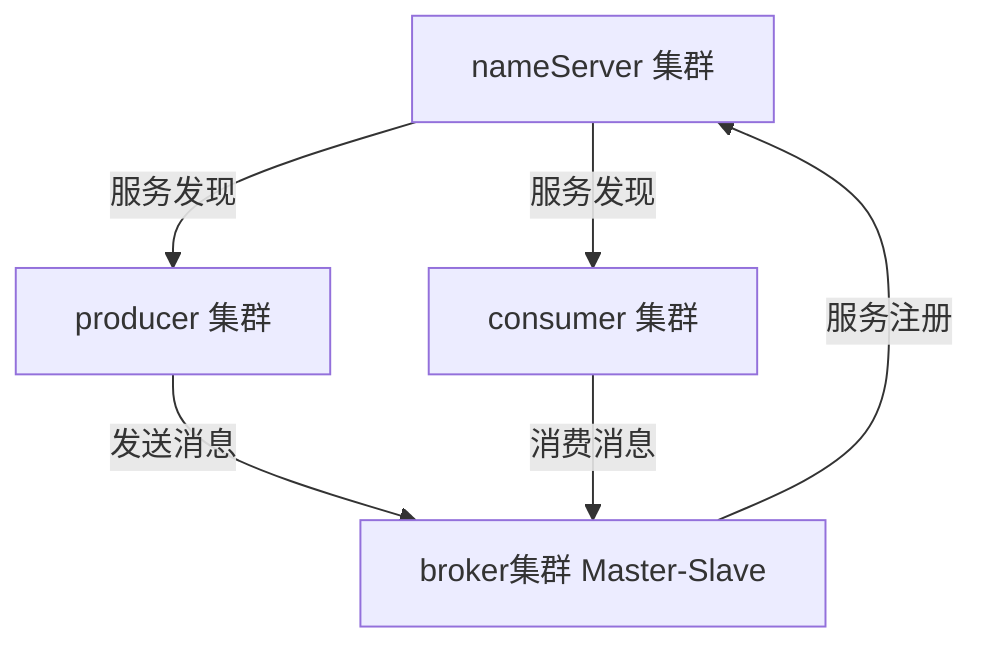

[官网](http://rocketmq.apache.org)   [GitHub](https://github.com/apache/rocketmq)


### 安装

下载

```shell
wget https://mirror.bit.edu.cn/apache/rocketmq/4.7.0/rocketmq-all-4.7.0-bin-release.zip
```


解压

```bash
unzip rocketmq-all-4.7.0-bin-release.zip
```


启动 `namesev`

```shell
cd rocketmq-all-4.7.0-bin-release/bin
./mqnamesrv
```

启动 `broker`

```bash
cd rocketmq-all-4.7.0-bin-release/bin
./mqbroker -n localhost:9876
```


常见错误：启动broker失败 `Cannot allocate memory`

解决方案：由于默认内存分配的太大了，超出了本机内存，修改`bin/`目录下的两个脚本 `runbroker.sh`  `runserver.sh` ，搜索 `-server -Xms`，将其内存改为 `512MB`


`namesrv` 启动成功标识：`The Name Server boot success`

`broker` 启动成功标识：`The broker[...] boot success`


### 安装 RocketMQ 控制台

控制台目前获取方式有如下两种：

- [ ] 第三方网站去下载现成的，比如`csdn`等

- [ ] 官方源码包自己编译而成，[github仓库](https://github.com/apache/rocketmq-externals)    [中文指南](https://github.com/apache/rocketmq-externals/blob/master/rocketmq-console/doc/1_0_0/UserGuide_CN.md)    [下载源码](https://codeload.github.com/apache/rocketmq-externals/zip/master)


下载源码后解压缩，控制台默认的端口号为`8080`，若想修改端口号，可以修改`rocketmq-console\src\main\resources\application.properties  `  文件的 `server.port`


编译打包：进入`rocketmq-console`，然后用maven进行编译打包

```shell
mvn clean package -DskipTests
```

打包完会在``target` 下生成spring boot的`jar`包，使用 `java -jar` 启动


### 启动控制台

将编译打包好的springboot程序扔到服务器上，执行如下命令进行启动：

```
java -jar rocketmq-console-ng-1.0.1.jar --rocketmq.config.namesrvAddr=127.0.0.1:9876
```

后台启动可添加 `nohup &`


### 测试

rocketmq提供的默认测试工具在bin目录下的`tools.sh`，测试前需要配置这个脚本，需指定`namesrv`地址，否则测试发送/消费消息的时候会出现`connect to null failed`错误 ，配置如下：

```bash
vim tools.sh
# 在export JAVA_HOME上面添加如下这段代码
export NAMESRV_ADDR=localhost:9876
```


发送消息

```bash
./tools.sh org.apache.rocketmq.example.quickstart.Producer

#成功的话会看到哗哗哗的日志，因为这个类会发送1000条消息到TopicTest这个Topic下
```


消费消息
```bash
./tools.sh org.apache.rocketmq.example.quickstart.Consumer

#成功的话会看到哗哗哗的日志，因为这个类会消费TopicTest下的全部消息，刚发送的1000条都会被消费掉
```

发送成功后可以到管控台去看消息和消费情况等信息


### RocketMQ角色




##### Broker


可理解为`RocketMQ`本身，主要用于`producer`和`consumer`接收和发送消息，会定时向`nameserver`提交自己的信息，是消息中间件的消息存储、转发服务器


每个`Broker`节点在启动时都会遍历`NameServer`列表，与每个`NameServer`建立长连接注册自己的信息，之后定时上报


##### Nameserver


- [ ] 理解成`zookeeper`的效果，只是他没用zk，而是自己写了个`nameserver`来替代zk
- [ ] 底层由`netty`实现，提供了路由管理、服务注册、服务发现的功能，是一个无状态节点
- [ ] `nameserver`是服务发现者，集群中各个角色``producer、broker、consumer`都需要定时向`nameserver`上报自己的状态，以便互相发现彼此，超时不上报的话，`nameserver`会把它从列表中剔除
- [ ] `nameserver`可以部署多个，当多个`nameserver`存在的时候，其他角色同时向他们上报信息，以保证高可用
- [ ] `NameServer`集群间互不通信，没有主备的概念
- [ ] `nameserver`内存式存储，`nameserver`中的`broker、topic`等信息默认不会持久化，所以他是无状态节点


##### Producer


- [ ] 消息的生产者，随机选择其中一个NameServer节点建立长连接，获得Topic路由信息，包括topic下的queue，这些queue分布在哪些broker上等等
- [ ] 接下来向提供topic服务的master建立长连接（因为rocketmq只有master才能写消息），且定时向master发送心跳


##### Consumer


- [ ] 消息的消费者，通过NameServer集群获得Topic的路由信息，连接到对应的Broker上消费消息
- [ ] 由于Master和Slave都可以读取消息，因此Consumer会与Master和Slave都建立连接进行消费消息


### 核心流程


- [ ] `Broker`都注册到`Nameserver`上
- [ ] `Producer`发消息的时候会从`Nameserver`上获取发消息的topic信息
- [ ] Producer向提供服务的所有master建立长连接，且定时向master发送心跳
- [ ] Consumer通过NameServer集群获得Topic的路由信息
- [ ] Consumer会与所有的Master和所有的Slave都建立连接进行监听新消息


### 核心概念

##### Message


消息载体，Message发送或者消费的时候必须指定Topic，Message有一个可选的Tag项用于过滤消息，还可以添加额外的键值对


##### topic


消息的逻辑分类，发消息之前必须要指定一个topic才能发，就是将这条消息发送到这个topic上，消费消息的时候指定这个topic进行消费，就是逻辑分类


##### queue


1个Topic会被分为N个Queue，数量是可配置的，message本身其实是存储到queue上的，消费者消费的也是queue上的消息，比如1个topic4个queue，有5个Consumer都在消费这个topic，那么会有一个consumer浪费掉了，因为负载均衡策略，每个consumer消费1个queue，5>4，溢出1个，这个会不工作


##### Tag


Tag 是 Topic 的进一步细分，每个发送的时候消息都能打tag，消费的时候可以根据tag进行过滤，选择性消费


##### Message Model


消息模型：集群`Clustering`和广播`Broadcasting`


##### Message Order


消息顺序：顺序`Orderly`和并发`Concurrently`


##### Producer Group


消息生产者组


##### Consumer Group


消息消费者组


### ACK

**ACK机制发生在Consumer端，**也就是说Consumer消费完消息后要进行ACK确认，消费成功标记成已消费，如果未确认则代表是消费失败，这时候Broker会进行重试策略（仅集群模式会重试）


### 消费模式


##### 集群模式 Clustering 


- [ ] 每条消息只需要被处理一次，broker只会把消息发送给消费集群中的一个消费者
- [ ] 在消息重投时，不能保证路由到同一台机器上
- [ ] 消费状态由broker维护


##### 广播模式 Broadcasting 


- [ ] 消费进度由`consumer`维护
- [ ] 保证每个消费者都消费一次消息
- [ ] 消费失败的消息不会重投


### Java API


##### 依赖

```xml
<dependency>
    <groupId>org.apache.rocketmq</groupId>
    <artifactId>rocketmq-client</artifactId>
    <version>4.7.0</version>
</dependency>
```


##### Producer

发消息肯定要必备如下几个条件：

- [ ] 指定生产组名（不能用默认的，会报错）
- [ ] 配置namesrv地址（必须）
- [ ] 指定topic name（必须）
- [ ] 指定tag/key（可选）

消息发送完后可以启动消费者进行消费，也可以去管控台上看消息是否存在


###### send 同步

```java
public class Producer {
    public static void main(String[] args) throws Exception {
        // 指定生产组名为my-producer
        DefaultMQProducer producer = new DefaultMQProducer("my-producer");
        // 配置namesrv地址
        producer.setNamesrvAddr("124.57.180.156:9876");
        // 启动Producer
        producer.start();
        // 创建消息对象，topic为：myTopic001，消息内容为：hello world
        Message msg = new Message("myTopic001", "hello world".getBytes());
        // 发送消息到mq，同步的
        SendResult result = producer.send(msg);
        System.out.println("发送消息成功！result is : " + result);
        // 关闭Producer
        producer.shutdown();
        System.out.println("生产者 shutdown！");
    }
}

//输出结果：
//发送消息成功！result is : SendResult [sendStatus=SEND_OK, msgId=A9FE854140F418B4AAC26F7973910000, offsetMsgId=7B39B49D00002A9F00000000000589BE, messageQueue=MessageQueue [topic=myTopic001, brokerName=broker-a, queueId=0], queueOffset=7]
//生产者 shutdown！
```


###### send 批量

```java
public class ProducerMultiMsg {
    public static void main(String[] args) throws Exception {
        // 指定生产组名为my-producer
        DefaultMQProducer producer = new DefaultMQProducer("my-producer");
        // 配置namesrv地址
        producer.setNamesrvAddr("124.57.180.156:9876");
        // 启动Producer
        producer.start();

        String topic = "myTopic001";
        // 创建消息对象，topic为：myTopic001，消息内容为：hello world1/2/3
        Message msg1 = new Message(topic, "hello world1".getBytes());
        Message msg2 = new Message(topic, "hello world2".getBytes());
        Message msg3 = new Message(topic, "hello world3".getBytes());
        // 创建消息对象的集合，用于批量发送
        List<Message> msgs = new ArrayList<>();
        msgs.add(msg1);
        msgs.add(msg2);
        msgs.add(msg3);
        // 批量发送的api的也是send()，只是他的重载方法支持List<Message>，同样是同步发送。
        SendResult result = producer.send(msgs);
        System.out.println("发送消息成功！result is : " + result);
        // 关闭Producer
        producer.shutdown();
        System.out.println("生产者 shutdown！");
    }
}

//输出结果
//发送消息成功！result is : SendResult [sendStatus=SEND_OK, msgId=A9FE854139C418B4AAC26F7D13770000,A9FE854139C418B4AAC26F7D13770001,A9FE854139C418B4AAC26F7D13770002, offsetMsgId=7B39B49D00002A9F0000000000058A62,7B39B49D00002A9F0000000000058B07,7B39B49D00002A9F0000000000058BAC, messageQueue=MessageQueue [topic=myTopic001, brokerName=broker-a, queueId=0], queueOffset=8]
//生产者 shutdown！
```


从结果中可以看到只有一个msgId，所以可以发现虽然是三条消息对象，但是却只发送了一次，大大节省了client与server的开销


错误情况：批量发送的topic必须是同一个，如果message对象指定不同的topic，那么批量发送的时候会报错：

```java
Exception in thread "main" org.apache.rocketmq.client.exception.MQClientException: Failed to initiate the MessageBatch
For more information, please visit the url, http://rocketmq.apache.org/docs/faq/
    at org.apache.rocketmq.client.producer.DefaultMQProducer.batch(DefaultMQProducer.java:950)
    at org.apache.rocketmq.client.producer.DefaultMQProducer.send(DefaultMQProducer.java:898)
    at com.chentongwei.mq.rocketmq.ProducerMultiMsg.main(ProducerMultiMsg.java:29)
Caused by: java.lang.UnsupportedOperationException: The topic of the messages in one batch should be the same
    at org.apache.rocketmq.common.message.MessageBatch.generateFromList(MessageBatch.java:58)
    at org.apache.rocketmq.client.producer.DefaultMQProducer.batch(DefaultMQProducer.java:942)
    ... 2 more
```


###### sendCallBack 异步

```java
public class ProducerASync {
    public static void main(String[] args) throws Exception {
       // 指定生产组名为my-producer
        DefaultMQProducer producer = new DefaultMQProducer("my-producer");
        // 配置namesrv地址
        producer.setNamesrvAddr("124.57.180.156:9876");
        // 启动Producer
        producer.start();

        // 创建消息对象，topic为：myTopic001，消息内容为：hello world async
        Message msg = new Message("myTopic001", "hello world async".getBytes());
        // 进行异步发送，通过SendCallback接口来得知发送的结果
        producer.send(msg, new SendCallback() {
            // 发送成功的回调接口
            @Override
            public void onSuccess(SendResult sendResult) {
                System.out.println("发送消息成功！result is : " + sendResult);
            }
            // 发送失败的回调接口
            @Override
            public void onException(Throwable throwable) {
                throwable.printStackTrace();
                System.out.println("发送消息失败！result is : " + throwable.getMessage());
            }
        });

        //由于是异步的，可能还没发消息就shutdown了，所以先睡1s
        Thread.sleep(1000);

        producer.shutdown();
        System.out.println("生产者 shutdown！");
    }
}

//输出结果
//发送消息成功！result is : SendResult [sendStatus=SEND_OK, msgId=A9FE854106E418B4AAC26F8719B20000, offsetMsgId=7B39B49D00002A9F0000000000058CFC, messageQueue=MessageQueue [topic=myTopic001, brokerName=broker-a, queueId=1], queueOffset=2]
//生产者 shutdown！
```


###### sendOneway

```java
public class ProducerOneWay {
    public static void main(String[] args) throws Exception {
        // 指定生产组名为my-producer
        DefaultMQProducer producer = new DefaultMQProducer("my-producer");
        // 配置namesrv地址
        producer.setNamesrvAddr("124.57.180.156:9876");
        // 启动Producer
        producer.start();

        // 创建消息对象，topic为：myTopic001，消息内容为：hello world oneway
        Message msg = new Message("myTopic001", "hello world oneway".getBytes());
        // 效率最高，因为oneway不关心是否发送成功，我就投递一下我就不管了。所以返回是void
        producer.sendOneway(msg);
        System.out.println("投递消息成功！，注意这里是投递成功，而不是发送消息成功哦！因为我sendOneway也不知道到底成没成功，我没返回值的。");
        producer.shutdown();
        System.out.println("生产者 shutdown！");
    }
}
//输出结果
//投递消息成功！，注意这里是投递成功，而不是发送消息成功哦！因为我sendOneway也不知道到底成没成功，我没返回值的。
//生产者 shutdown！
```


###### 效率对比

sendOneway > sendCallBack > send批量 > send单条

很容易理解，sendOneway不求结果只负责投递，不管失败还是成功，相当于中转站，来了就扔出去，不进行任何其他处理，所以最快

而sendCallBack是异步发送肯定比同步的效率高

send批量和send单条的效率也是分情况的，如果只有1条msg要发，那还搞毛批量，直接send单条完事


##### Consumer

**每个consumer只能关注一个topic，**发消息肯定要必备如下几个条件：

- [ ] 指定消费组名（不能用默认的，会报错）
- [ ] 配置namesrv地址（必须）
- [ ] 指定topic name（必须）
- [ ] 指定tag/key（可选）


###### CLUSTERING

集群模式，RockerMQ默认的消费模式，比如启动五个Consumer，Producer生产一条消息后，Broker会选择五个Consumer中的其中一个进行消费这条消息，属于点对点消费模式

```java
public class Consumer {
    public static void main(String[] args) throws Exception {
        // 指定消费组名为my-consumer
        DefaultMQPushConsumer consumer = new DefaultMQPushConsumer("my-consumer");
        // 配置namesrv地址
        consumer.setNamesrvAddr("124.57.180.156:9876");
        // 订阅topic：myTopic001 下的全部消息（因为是*，*指定的是tag标签，代表全部消息，不进行任何过滤）
        consumer.subscribe("myTopic001", "*");
        // 注册监听器，进行消息消息。
        consumer.registerMessageListener(new MessageListenerConcurrently() {
            @Override
            public ConsumeConcurrentlyStatus consumeMessage(List<MessageExt> msgs, ConsumeConcurrentlyContext consumeConcurrentlyContext) {
                for (MessageExt msg : msgs) {
                    String str = new String(msg.getBody());
                    // 输出消息内容
                    System.out.println(str);
                }
                // 默认情况下，这条消息只会被一个consumer消费，这叫点对点消费模式。也就是集群模式。
                // ack确认
                return ConsumeConcurrentlyStatus.CONSUME_SUCCESS;
            }
        });
        // 启动消费者
        consumer.start();
        System.out.println("Consumer start");
    }
}
```


###### BROADCASTING

广播模式，比如启动五个Consumer，Producer生产一条消息后，Broker会把这条消息广播到五个Consumer中，这五个Consumer分别消费一次，每个都消费一次

```
// 代码里只需要添加如下这句话即可：
consumer.setMessageModel(MessageModel.BROADCASTING); 
```


###### 两种模式对比

- [ ] 集群默认是默认的，广播模式需要手动配置
- [ ] 一条消息：集群模式下的多个Consumer只会有一个Consumer消费，广播模式下的每一个Consumer都会消费这条消息
- [ ] 广播模式下，发送一条消息后，会被当前被广播的所有Consumer消费，但是后面新加入的Consumer不会消费这条消息，很好理解：村里面大喇叭喊了全村来领鸡蛋，第二天你们村新来个人，那个人肯定听不到昨天大喇叭喊的消息呀


##### TAG&&KEY

发送/消费 消息的时候可以指定tag/key来进行过滤消息，支持通配符，`*`代表消费此topic下的全部消息，不进行过滤


`org.apache.rocketmq.common.message.Message`源码可以发现发消息的时候可以指定tag和keys：

```java
public Message(String topic, String tags, String keys, byte[] body) {
    this(topic, tags, keys, 0, body, true);
}
```

比如：

```java
public class ProducerTagsKeys {
    public static void main(String[] args) throws Exception {
        // 指定生产组名为my-producer
        DefaultMQProducer producer = new DefaultMQProducer("my-producer");
        // 配置namesrv地址
        producer.setNamesrvAddr("124.57.180.156:9876");
        // 启动Producer
        producer.start();
        // 创建消息对象，topic为：myTopic001，消息内容为：hello world，且tags为：test-tags，keys为test-keys
        Message msg = new Message("myTopic001", "test-tags", "test-keys", "hello world".getBytes());
        // 发送消息到mq，同步的
        SendResult result = producer.send(msg);
        System.out.println("发送消息成功！result is : " + result);
        // 关闭Producer
        producer.shutdown();
        System.out.println("生产者 shutdown！");
    }
}

//输出结果
//发送消息成功！result is : SendResult [sendStatus=SEND_OK, msgId=A9FE854149DC18B4AAC26FA4B7200000, offsetMsgId=7B39B49D00002A9F0000000000058DA6, messageQueue=MessageQueue [topic=myTopic001, brokerName=broker-a, queueId=3], queueOffset=3]
//生产者 shutdown！

```


查看管控台，可以发现tags和keys已经生效


##### 常见错误


###### sendDefaultImpl call timeout

```java
Exception in thread "main" org.apache.rocketmq.remoting.exception.RemotingTooMuchRequestException: sendDefaultImpl call timeout
    at org.apache.rocketmq.client.impl.producer.DefaultMQProducerImpl.sendDefaultImpl(DefaultMQProducerImpl.java:666)
    at org.apache.rocketmq.client.impl.producer.DefaultMQProducerImpl.send(DefaultMQProducerImpl.java:1342)
    at org.apache.rocketmq.client.impl.producer.DefaultMQProducerImpl.send(DefaultMQProducerImpl.java:1288)
    at org.apache.rocketmq.client.producer.DefaultMQProducer.send(DefaultMQProducer.java:324)
    at com.chentongwei.mq.rocketmq.Producer.main(Producer.java:18)
```

解决方法：

1.如果你是云服务器，首先检查安全组是否允许9876这个端口访问，是否开启了防火墙，如果开启了的话是否将9876映射了出去

2.修改配置文件`broker.conf`，加上：

```bash
brokerIP1=我用的是阿里云服务器，这里是我的公网IP
```

启动namesrv和broker的时候加上本机IP（我用的是阿里云服务器，这里是我的公网IP）：

```bash
./bin/mqnamesrv -n IP:9876
./bin/mqbroker -n IP:9876 -c conf/broker.conf
```


###### No route info of this topic

```java
Exception in thread "main" org.apache.rocketmq.client.exception.MQClientException: No route info of this topic: myTopic001
See http://rocketmq.apache.org/docs/faq/ for further details.
    at org.apache.rocketmq.client.impl.producer.DefaultMQProducerImpl.sendDefaultImpl(DefaultMQProducerImpl.java:684)
    at org.apache.rocketmq.client.impl.producer.DefaultMQProducerImpl.send(DefaultMQProducerImpl.java:1342)
    at org.apache.rocketmq.client.impl.producer.DefaultMQProducerImpl.send(DefaultMQProducerImpl.java:1288)
    at org.apache.rocketmq.client.producer.DefaultMQProducer.send(DefaultMQProducer.java:324)
    at com.chentongwei.mq.rocketmq.Producer.main(Producer.java:18)
```

解决方法：

很明显发送成功了，不再是刚才的超时了，但是告诉我们没有这个topic。那不能每次都手动创建呀，所以启动broker的时候可以指定参数让broker为我们自动创建。如下

```bash
./bin/mqbroker -n IP:9876 -c conf/broker.conf autoCreateTopicEnable=true
```


